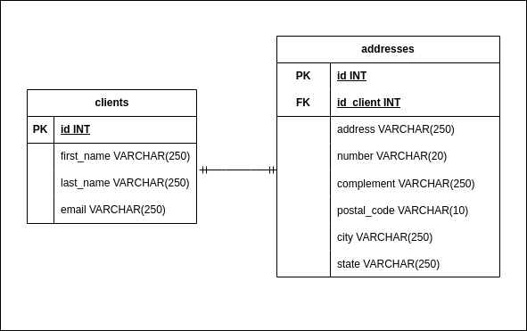

# Teste Vaga ***Tokio Marine*** Desenvolvedor Pleno

Aplicação para teste da empresa *Tokio Marine* para desenvolvedor Pleno, um CRUD de uma entidade Client, com sua relação com a entidade Address (imagem 1).

Imagem 1 - Modelagem usada como base para criação das entidades

O front-end contém duas telas, uma com a listagem, edição, exclusão e busca e clientes, e outra com um formulário para cadastro de clientes.

### Principais tecnologias empregadas

- H2
- Java
- Spring Boot
- SpringFox Swagger
- JUnit 5
- TypeScript
- Angular

## Executando o projeto

### Pré-requisitos

Ter `Java`, `Maven`, `Node.js` e `Angular CLI` baixados na máquina.

Para o banco de dados, não é necessário nenhuma altração, pois o H2 é configurado e começa a rodas automaticamente junto da apliação.

### Execução dos projetos

Navegue até o diretório `api-java` no terminal e execute o comando `mvn spring-boot:run`.

Navegue até o diretório `ui-angular` em um outro terminal e execute o comando `ng serve`.

## Documentação

Para acessar a documentação do Swagger, basta acessar a url `http://localhost:8080/consulta-usuario-tokio/swagger-ui.html`.
